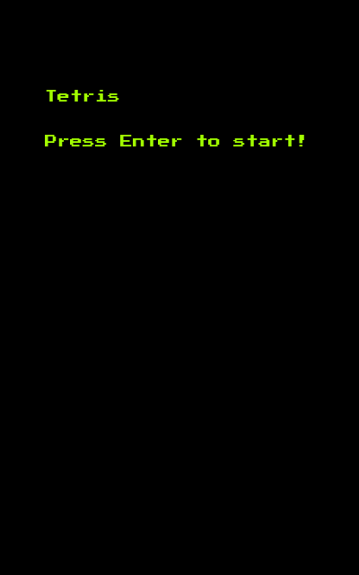
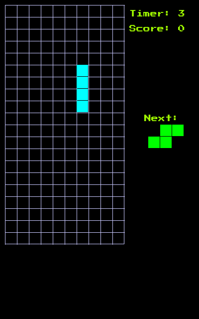
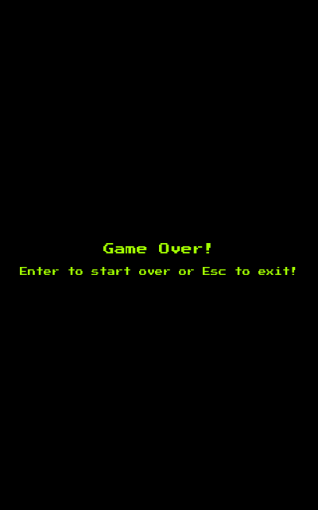

# Tetris

Tetris clone, made for fun, using SDL3 on C++20.

## How to compile and run

Make sure to have SDL3, SDL3_ttf and SDL3_image installed in your system.

On Manjaro you may use:

    pamac install SDL3 SDL3_ttf SDL3_image
    
Then go to the source dir and:

    cd tetris
    mkdir build && cd build
    cmake .. && make
    ./tetris

## Screenshots

